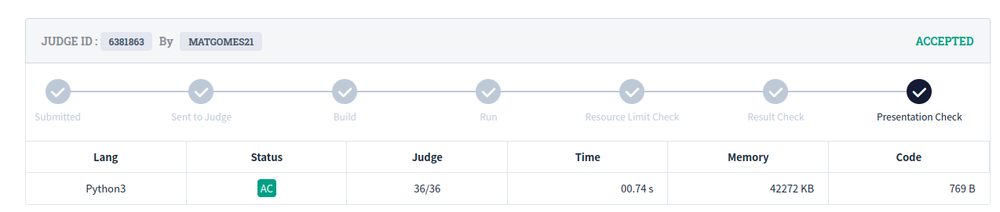
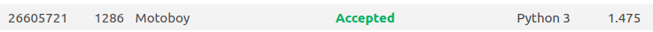
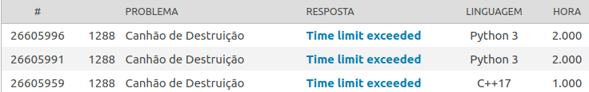

# Greed_Dupla5

**Número da Lista**: 3 
**Conteúdo da Disciplina**: Greed 

## Alunos
|Matrícula | Aluno |
| -- | -- |
| 18/0106821	  |  Mateus Gomes do Nascimento |
| 18/0132245	  |  Vinicius de Sousa Saturnino |

## Sobre 
Este projeto tem como objetivo resolver exercícios de juízes online utilizando algoritmos ambiciosos.

## Screenshots

### Problema Aizu Knapsack

[Link para o problema](https://onlinejudge.u-aizu.ac.jp/problems/DPL_1_B)

### Problema Uri 1286

[Link para o problema](https://www.beecrowd.com.br/judge/pt/problems/view/1286)

### Problema Uri 1288

[Link para o problema](https://www.beecrowd.com.br/judge/pt/problems/view/1288)

## Instalação 
**Linguagem**: Python 
**Framework**: Sem framework 

Para rodar as soluções, deve-se ter o python instalado (recomenda-se versão 3.4+).

## Uso 
Para rodar os algoritmos, deve-se ir até a pasta solutions, e executar os scripts em python.

